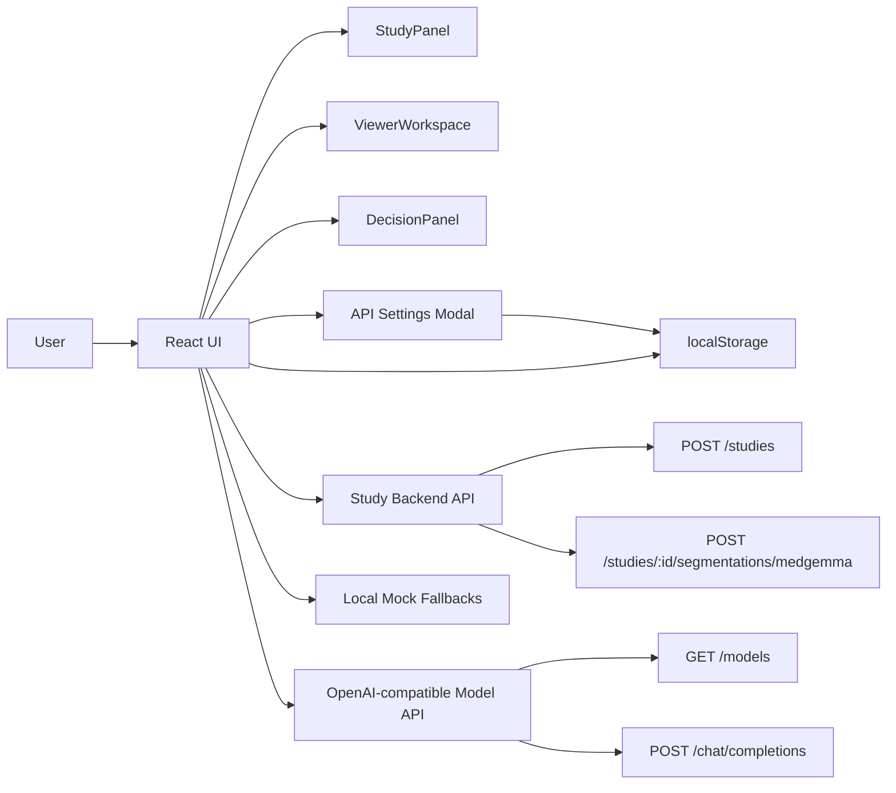
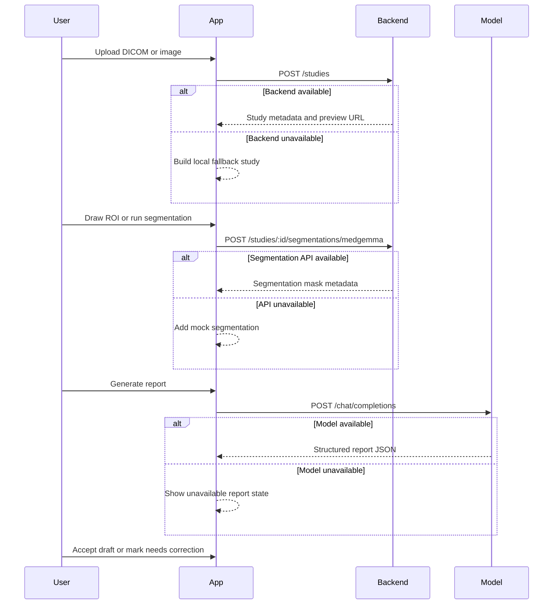

# Radiology AI

A Vite, React, TypeScript, and Tailwind CSS prototype for a radiology review workflow. The app lets a user upload a DICOM or image study, mark regions of interest, request segmentation, generate a structured AI draft report, and record clinician review feedback.

The frontend can work without backend services by falling back to local mock study, segmentation, and report states. When services are available, it calls a study backend and an OpenAI-compatible Medgemma endpoint.

## Features

- Upload one or more DICOM or image files.
- Preview uploaded image studies or show a built-in synthetic scan placeholder.
- Draw ROI prompts directly on the image viewport.
- Request Medgemma segmentation through the configured backend API.
- Generate a structured radiology report from an OpenAI-compatible chat completions endpoint.
- Review report output, accept the draft, or record correction notes.
- Undo, redo, clear, toggle segmentation masks, adjust brightness, and zoom the viewport.
- Edit API endpoint URL, API key, and model identifier at runtime from the settings icon.

## Tech Stack

- React 19
- TypeScript 5
- Vite 7
- Tailwind CSS 3
- lucide-react icons

## Project Structure

```text
radiology/
|-- index.html
|-- package.json
|-- postcss.config.js
|-- tailwind.config.js
|-- tsconfig.json
|-- tsconfig.app.json
|-- tsconfig.node.json
|-- vite.config.ts
|-- src/
|   |-- App.tsx
|   |-- main.tsx
|   |-- styles.css
|   `-- vite-env.d.ts
`-- README.md
```

## Architecture

The app is currently a client-side single-page application. Most behavior lives in `src/App.tsx`, split into typed data models, API helpers, stateful app orchestration, and presentation components.



### Main Runtime Pieces

- `App`: owns active study state, viewport state, review state, API settings, and modal visibility.
- `StudyPanel`: uploads files and lists loaded studies.
- `ViewerWorkspace`: renders the image/scan viewport, brightness and zoom controls, ROI drawing, segmentation overlays, and undo/redo controls.
- `DecisionPanel`: shows report generation controls, model readiness, report sections, masks, and clinician review actions.
- `ApiSettingsModal`: lets users edit backend URL, model endpoint URL, optional bearer token, and model identifier.
- `FeedbackModal`: captures clinician correction notes.
- API helpers: `postStudyFile`, `requestSegmentation`, `requestReport`, and `requestLlmStatus`.

## Configuration

The app has build-time defaults and browser-editable runtime settings.

### Build-time Defaults

Set these Vite environment variables if you want defaults other than the local values:

```bash
VITE_API_BASE_URL=http://127.0.0.1:8000
VITE_MEDGEMMA_API_URL=http://127.0.0.1:1234/v1
VITE_MEDGEMMA_MODEL=medgemma-1.5-4b-it
```

If omitted, the app uses the values shown above.

### Runtime Settings

Open the gear icon in the AI Review panel to edit:

- Backend API URL
- Model endpoint URL
- API key, if required
- Model identifier

Runtime settings are saved in the browser under the `radiology-api-settings` localStorage key. The API key is stored client-side, so this is suitable for local development and demos, not for protecting production secrets.

## External API Contract

The frontend expects the following endpoints when real services are used.

### Study Backend

```text
POST /studies
```

Request body: multipart form data with a `file` field.

Expected response: partial `Study` JSON. If `previewUrl` is relative, the frontend resolves it against the configured backend base URL.

```text
POST /studies/:studyId/segmentations/medgemma
```

Request body:

```json
{
  "prompt": {
    "x": 0.47,
    "y": 0.34,
    "width": 0.16,
    "height": 0.22
  }
}
```

Expected response:

```json
{
  "id": "seg-1",
  "label": "Lesion ROI",
  "confidence": 0.82,
  "volumeMl": 12.4,
  "source": "medgemma",
  "box": {
    "x": 0.47,
    "y": 0.34,
    "width": 0.16,
    "height": 0.22
  }
}
```

### Model Endpoint

The Medgemma endpoint should be OpenAI-compatible:

```text
GET /models
POST /chat/completions
```

The app sends `Authorization: Bearer <key>` when an API key is configured.

The report prompt asks the model to return JSON with:

```json
{
  "summary": "one-line clinical summary",
  "findings": "detailed findings paragraph",
  "impression": "clinical impression",
  "recommendation": "follow-up recommendation",
  "confidence": 0.75
}
```

## Workflow



## Getting Started

Install dependencies:

```bash
npm install
```

Start the development server:

```bash
npm run dev
```

Build for production:

```bash
npm run build
```

Preview the production build:

```bash
npm run preview
```

## Development Notes

- The UI is intentionally usable with no backend by falling back to local mock states.
- API URLs are normalized by removing trailing slashes before requests are built.
- The model readiness check treats an exact match for the configured model identifier as ready, then falls back to any model ID containing `medgemma`.
- Uploaded browser object URLs are used for local image previews.
- The app is a prototype decision-support workflow and should not be treated as an autonomous diagnosis tool.
